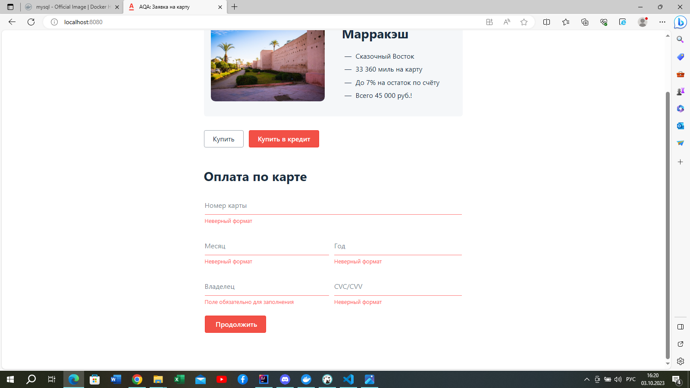
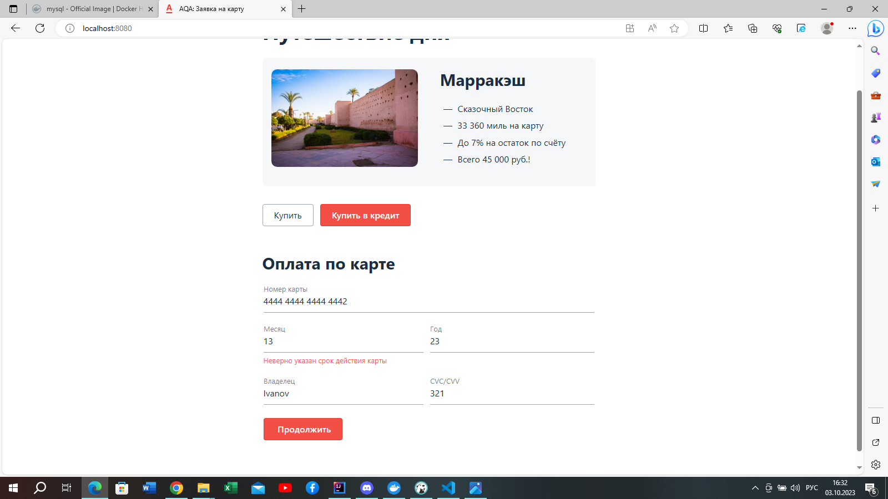
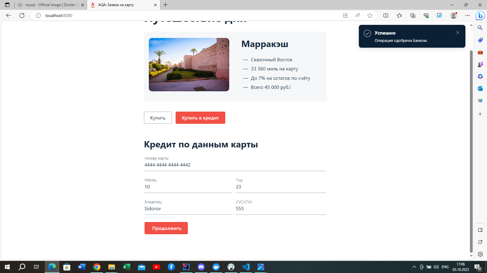

# План по автоматизации тестирования веб-формы сервиса покупки туров 

## 1. Перечень автоматизируемых сценариев:
### 1. Покупка тура через кнопку "Купить" на главной странице:
* Открыть главную страницу сервиса http://localhost:8080/
* Нажать на кнопку "Купить"

1.1 Успешная покупка: при оплате картой с валидным номером и достаточным количеством средств на счете
* Заполнить поля "Номер карты", "Месяц", "Год", "Владелец" и "CVC/CVV" валидными данными карты, позволяющим совершить платеж
* Нажать на кнопку "Продолжить"

#### Ожидаемый результат: появляется сообщение: "Успешно. Операция одобрена банком"

1.2 Негативный сценарий покупки при оплате картой на сайте:
* 1.2.1. Покупка тура по карте с недостаточным количеством средств на счете

* Заполнить поля "Номер карты", "Месяц", "Год", "Владелец" и "CVC/CVV" валидными данными карты с недостаточным количеством средств на карте для совершения платежа.
* Нажать на кнопку "Продолжить".
#### Ожидаемый результат: появляется сообщение: "Ошибка! Банк отказал в проведении операции"

1.2.2. Все поля формы оставить пустыми:
* Оставить все поля формы незаполненными.
* Нажать на кнопку "Продолжить".
#### Ожидаемый результат: под каждым полем появляется сообщение:"Поле обязательно для заполнения" и "Неверный формат".

1.2.3. Заполнить поле "Номер карты" невалидными значениями:
* Указать в поле "Номер карты" невалидное значение - 14 цифр.
* Заполнить остальные поля валидными данными.
* Нажать на кнопку "Продолжить".
#### Ожидаемый результат: под полем "Номер карты" появляется сообщение:"Неверный формат".
* Оставить пустым поле "Номер карты".
* Заполнить остальные поля валидными данными.
* Нажать на кнопку "Продолжить".
#### Ожидаемый результат: появляется сообщение:"Поле обязательно для заполнения".
1.2.4. Заполнить поле "Месяц" невалидными значениями: 
* В поле "Месяц" вести формат однозначного числа - 1.
* Заполнить остальные поля валидными данными.
* Нажать на кнопку "Продолжить".
#### Ожидаемый результат: под полем "Месяц" появляется сообщение:"Неверный формат".

* Оставить поле "Месяц" пустым.
* Заполнить остальные поля валидными данными.
* Нажать на кнопку "Продолжить".
#### Ожидаемый результат: под полем "Месяц" появляется сообщение:"Поле обязательно для заполнения"
* В поле "Месяц" ввести значение "13".
* Заполнить остальные поля валидными данными.
* Нажать на кнопку "Продолжить".
#### Ожидаемый результат: под полем "Месяц" появляется сообщение:"Неверно указан срок действия карты"

* В поле "Месяц" ввести 00.
* Заполнить остальные поля валидными данными.
* Нажать на кнопку "Продолжить".
#### Ожидаемый результат: под полем "Месяц" появляется сообщение:"Неверный формат".
1.2.5. Заполнить поле "Год" невалидными значениями:
* В поле год ввести однозначное число - 1.
* Заполнить остальные поля валидными данными.
* Нажать на кнопку "Продолжить". 
#### Ожидаемый результат: под полем "Год" появляется сообщение:"Неверный формат"
.
* Оставить поле "Год" пустым.
* Заполнить остальные поля валидными данными.
* Нажать на кнопку "Продолжить".
#### Ожидаемый результат: под полем "Год" появляется сообщение:"Неверный формат".
1.2.6. Заполнить поле "Владелец" невалидными значениями:
* Оставить поле "Владелец" пустым.
* Заполнить остальные поля валидными данными.
* Нажать кнопку "Продолжить".
#### Ожидаемый результат: под полем "Владелец" появляется сообщение: "Поле обязательно для заполнения".

* В поле "Владелец" ввести цифры 123. 
* Заполнить остальные поля валидными данными.
* Нажать кнопку "Продолжить".
#### Ожидаемый результат: под полем "Владелец" появляется сообщение:"Неверный формат".
* В поле "Владелец" ввести кириллицу - "Сидоров".
* Заполнить остальные поля валидными данными.
* Нажать кнопку "Продолжить".
#### Ожидаемый результат: под полем "Владелец" появляется сообщение:"Неверный формат".
1.2.7. Заполнить поле "CVC/CVV" невалидными значениями:
* Поле "CVC/CVV" оставить пустым.
* Заполнить остальные поля валидными данными.
* Нажать кнопку "Продолжить".
#### Ожидаемый результат: под полем "CVC/CVV" появляется сообщение: "Поле обязательно для заполнения"
* В поле "CVC/CVV" ввести 2.
* Заполнить остальные поля валидными данными.
* Нажать кнопку "Продолжить".
#### Ожидаемый результат: gод полем "CVC/CVV" появляется сообщение: "Неверный формат".
* В поле "CVC/CVV" ввести 22.
* Заполнить остальные поля валидными данными.
* Нажать кнопку "Продолжить".
#### Ожидаемый результат: под полем "CVC/CVV" появляется сообщение: "Неверный формат".
* В поле "CVC/CVV" ввести 000.
* Заполнить остальные поля валидными данными.
* Нажать кнопку "Продолжить".
#### Ожидаемый результат: под полем "CVC/CVV" появляется сообщение: "Неверный формат".

### 2. Покупка тура через кнопку "Купить в кредит" с главной страницы
* Открыть главную страницу сервиса http://localhost:8080/
* Нажать кнопку "Купить в кредит".

2.1 Успешная покупка через кнопку "Покупка в кредит" при оплате картой с достаточным кредитным лимитом
* Заполнить все поля валидными данными карты с достаточным количеством средств на счете.
* Нажать кнопку "Продолжить".
#### Ожидаемый результат: появляется сообщение "Успешно. Операция одобрена банком".

2.2 Негативный сценарий покупка тура в кредит:
#### Алгоритм действий одинаков со сценарием при покупке тура через кнопку "Купить"  (смотреть 1.2.1 - 1.2.7).

## 2. Перечень используемых инструментов с обоснованием выбора

1. IntelliJ IDEA - система программных средств для создания проектов на разных языках программирования, послужит для написания тестирования кода.

2. Gradle - система автоматической сборки проекта, послужит для сборки исходного кода Java и его зависимостей.

3. JUnit 5 - это мощное и гибкое обновление фреймворка JUnit, которое предоставляет множество улучшений и новых функций для написания тестов. 

4. Selenide - самый популярный фреймворк, эта библиотека послужит для написания тестов. 

5. Docker - программное обеспечение с открытым исходным кодом, применяемое для разработки, тестирования, доставки и запуска веб-приложений в средах с поддержкой контейнеризации.

6. Allure - инструмент для создания отчетов о результатах тестирования в автоматизированных тестовых сценариях.

7. Git - система контроля версий, которая позволяет отслеживать любые изменения в файлах, хранить их версии и оперативно возвращаться в любое сохранённое состояние.

8. APPVeyor - веб-сервис непрерывной интеграции, предназначенный для сборки и тестирования программного обеспечения, расположенного на GitHub.

9. Lombok - это библиотека для сокращения кода в классах и расширения функциональности языка Java.

## 3.Перечень и описание возможных рисков при автоматизации
1. Проблемы с запуском приложения (остуствие достаточных навыков).
2. Проблемы с подключением к БД.
3. Сложность в нахождении css-селекторов.
4. Трудности с написанием тестов.

## 4. Интервальная оценка с учётом рисков (в часах)
1. Подготовительный этап настройки структуры проекта, клонирования исходников - 4 часа.
2. Запуск jar файла, подключение к БД - 48 часов.
3. Разработка плана тестирования - 48 часа. 
4. Написание кода автотестов -  72 часа.
5. Прогонка тестов - 10 часов (при необходимости внесение корректировки).
6. Подготовка отчетной документации по итогам тестирования - 72 часа.
7. Время на решение проблем, возникших в процессе автоматизации - 10 часов.

## 5. Планируемые даты сдачи дипломного проекта
1. Сдача плана тестирования - до 05.10.2023
2. Сдача на проверку автотестов - 17.10.2023 
3. Сдача документ по итогам тестирования - 20.10.2023

