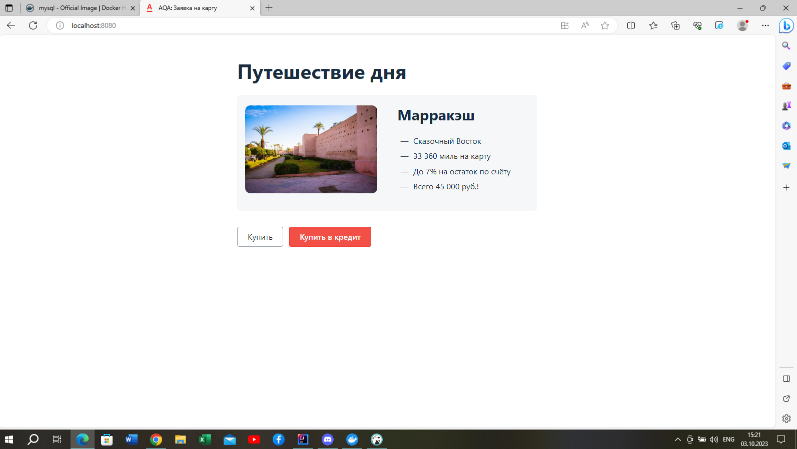
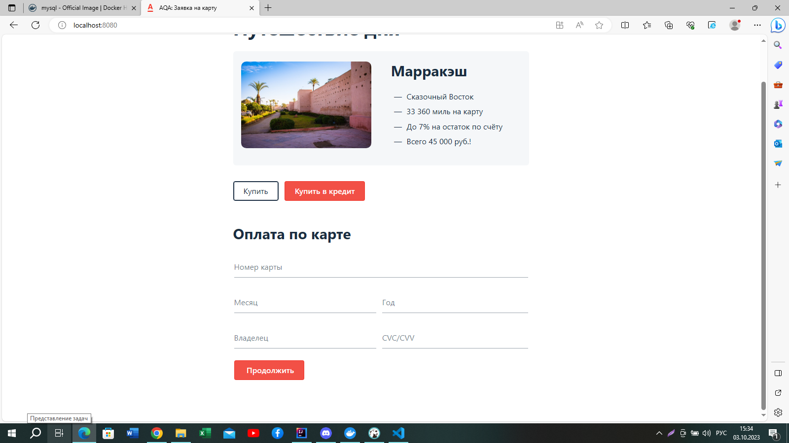
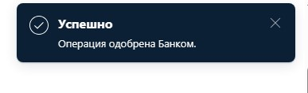
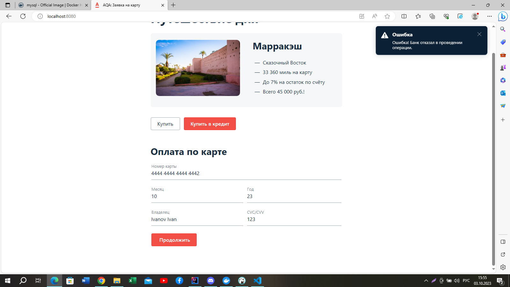
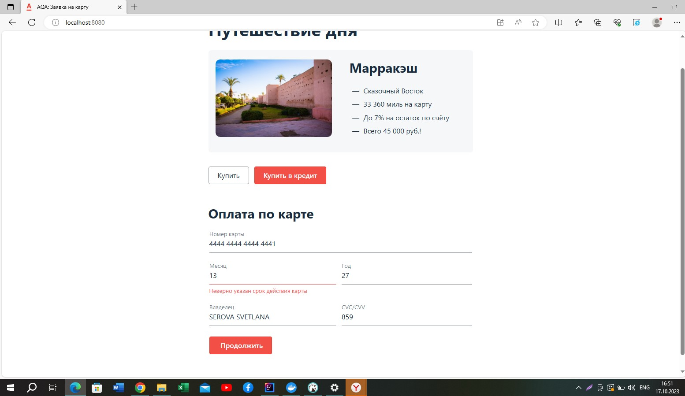
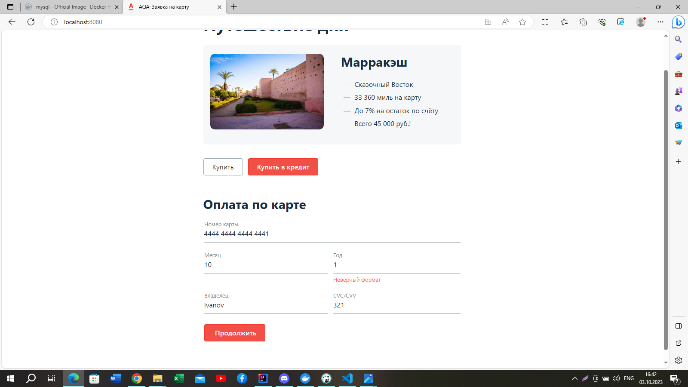
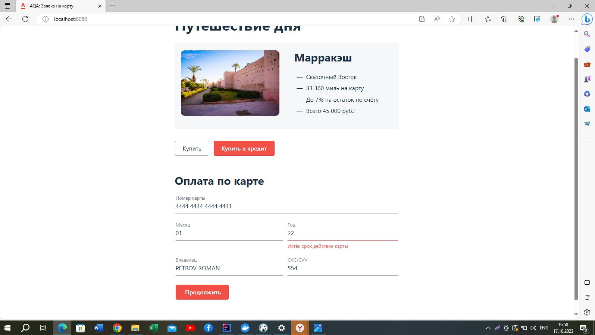
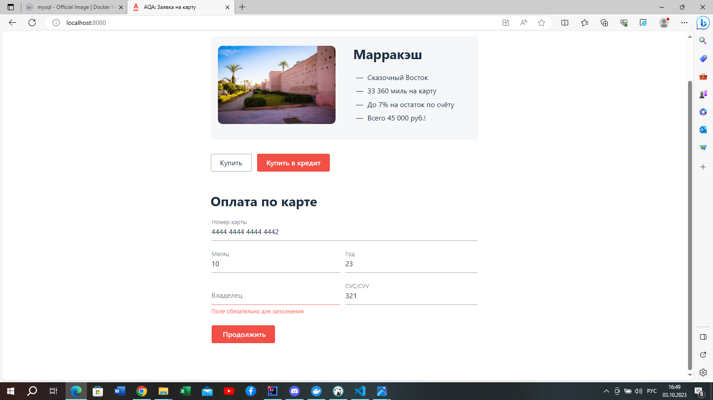
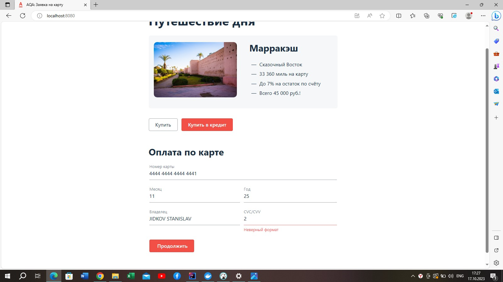
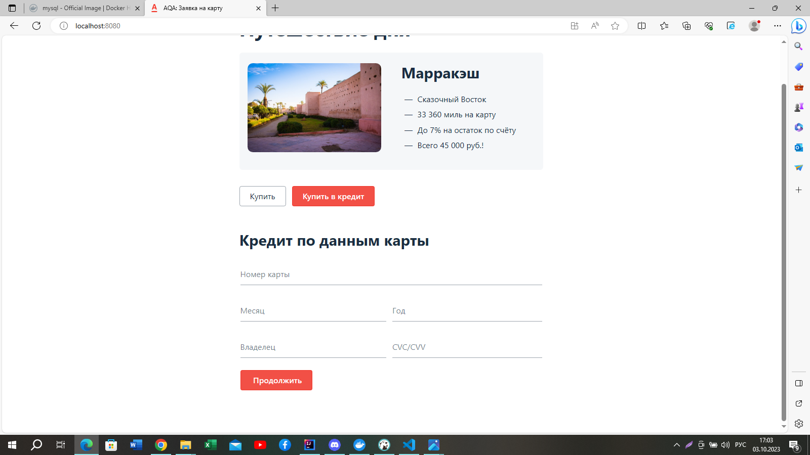

# План по автоматизации тестирования веб-формы сервиса покупки туров 

## I. Перечень автоматизируемых сценариев:
<u>Валидные входные данные полей веб-формы сервиса покупки туров:</u>
1. Поле "НОМЕР КАРТЫ":
* содержит 16 арабских цифр;
* ввод букв,символов, пробелов недопустим.
2. Поле "МЕСЯЦ":
* содержит 2 арабских цифры;
* допустимые цифры и их формат - 01,02,03,04,05,06,07,08,09,10,11,12, что соответствует номеру месяца в году.
* иные числа и формат недопустим;
* ввод месяца, предшествующий текущему месяцу, при условии, что год введен текущим, недопустим, срок карты считается истекшим.
3. Поле "ГОД":
* содержит 2 арабских цифры;
* допустимые значения цифр и их формат - 23,24,25,26,27,28 (максимальный срок действия пластика от 2 до 5 лет);
* иные числа и формат недопустим;
4. Поле "ВЛАДЕЛЕЦ":
* содержит только латинские буквы;
* допустимы двойные фамилии;
* допустимо применение специального символа "-";
* допустим верхний и нижний регистр;
* минимальное количество букв - 2;
* допустим 1 пробел между именем и фамилией, между cоставляющими двойной фамилии;
* цифр и иные специальные символы недопустимы;
5. Поле CVC/CVV:
* содержит 3 арабских цифры;
* не допустимо заполнять специальными символами, буквами;
* пробелы не используются;

### 1. Покупка тура через кнопку "Купить" на главной странице: 
* Открыть главную страницу сервиса http://localhost:8080/
* Нажать на кнопку "Купить"

Сценарий №1 "Позитивный сценарий отправки формы с валидными входными данными":

* НОМЕР КАРТЫ: 4444 4444 4444 4441 (одобренная);
* МЕСЯЦ: 02;
* ГОД: 24;
* ВЛАДЕЛЕЦ: IVANOV IVAN;
* CVC/CVV: 321;
* Нажать на кнопку "Продолжить".
#### Ожидаемый результат: появляется сообщение: "Успешно. Операция одобрена банком"
Статус в БД:
Ответ от сервера - код 200, статус карты "APPROVED"

Сценарий №2 "Позитивный сценарий отправки формы с валидными входными данными (с указанием двойной фамилии)":
* НОМЕР КАРТЫ: 4444 4444 4444 4441;
* МЕСЯЦ: 11;
* ГОД: 25;
* ВЛАДЕЛЕЦ: IVANOV-KRAMSKOI OLEG;
* CVC/CVV: 456;
* Нажать на кнопку "Продолжить".
#### Ожидаемый результат: появляется сообщение: "Успешно. Операция одобрена банком"

Сценарий №3 "Негативный сценарий по карте со статусом "отклоненная":
* НОМЕР КАРТЫ: 4444 4444 4444 4442 (отклоненная);
* МЕСЯЦ: 10;
* ГОД: 25;
* ВЛАДЕЛЕЦ: IVANOV IVAN;
* CVC/CVV: 123
* Нажать на кнопку "Продолжить".
#### Ожидаемый результат: появляется сообщение: "Ошибка! Банк отказал в проведении операции."
Статус в БД:
Ответ от сервера - код 200, статус карты "DECLINED".

Сценарий №4 "Негативный сценарий с пустыми полями формы":
* Оставить все поля формы незаполненными.
* Нажать на кнопку "Продолжить".
#### Ожидаемый результат: под каждым полем появляется сообщение:"Поле обязательно для заполнения".

Сценарий №5 "Негативный сценарий  с невалидным значением в поле "Номер карты" (указать 14 цифр):
* НОМЕР КАРТЫ: 4444 4444 4444 44;
* МЕСЯЦ: 01;
* ГОД: 24;
* ВЛАДЕЛЕЦ: ZIMENEVA OLGA;
* CVC/CVV: 698
* Нажать на кнопку "Продолжить".
#### Ожидаемый результат: под полем "Номер карты" появляется сообщение: "Неверный формат".

Сценарий №6 "Негативный сценарий с пустым полем Номер Карты":
* НОМЕР КАРТЫ:                 
* МЕСЯЦ: 04;
* ГОД: 26;
* ВЛАДЕЛЕЦ: DEMIDOV OLEG;
* CVC/CVV: 954
* Нажать на кнопку "Продолжить".
#### Ожидаемый результат: под полем "Номер карты" появляется сообщение: "Поле обязательно для заполнения".

Сценарий №7 "Негативный сценарий с пустым полем "Месяц": 
* НОМЕР КАРТЫ: 4444 4444 4444 4441;
* МЕСЯЦ: 
* ГОД: 25;
* ВЛАДЕЛЕЦ: KONOV VLAD;
* CVC/CVV: 456
* Нажать на кнопку "Продолжить".
#### Ожидаемый результат: под полем "Месяц" появляется сообщение:"Поле обязательно для заполнения".

Сценарий №8 "Негативный сценарий с невалидным значением в поле "Месяц" (месяц - 13):
* НОМЕР КАРТЫ: 4444 4444 4444 4441;
* МЕСЯЦ: 13;
* ГОД: 27;
* ВЛАДЕЛЕЦ: SEROVA SVETLANA;
* CVC/CVV: 859
* Нажать на кнопку "Продолжить".
#### Ожидаемый результат: под полем "Месяц" появляется сообщение:"Неверно указан срок действия карты"

Сценарий №9 "Негативный сценарий с невалидным значением в поле "Месяц" (месяц - 00)":
* НОМЕР КАРТЫ: 4444 4444 4444 4441;
* МЕСЯЦ: 00;
* ГОД: 28;
* ВЛАДЕЛЕЦ: GALICH VASILII;
* CVC/CVV: 127
* Нажать на кнопку "Продолжить".
#### Ожидаемый результат: под полем "Месяц" появляется сообщение: "Неверный формат".

Сценарий №10 "Негативный сценарий с невалидным значением в поле "Год" (год - 1):
* НОМЕР КАРТЫ: 4444 4444 4444 4441;
* МЕСЯЦ: 03;
* ГОД: 1;
* ВЛАДЕЛЕЦ: VASINA EKETERINA;
* CVC/CVV: 874
* Нажать на кнопку "Продолжить".
#### Ожидаемый результат: под полем "Год" появляется сообщение:"Неверный формат"
.

Сценарий №11 "Негативный сценарий с пустым полем "Год":
* НОМЕР КАРТЫ: 4444 4444 4444 4441;
* МЕСЯЦ: 08;
* ГОД: 
* ВЛАДЕЛЕЦ: PROSHKINA VASILISA;
* CVC/CVV: 985
* Нажать на кнопку "Продолжить".
#### Ожидаемый результат: под полем "Год" появляется сообщение:"Поле обязательно для заполнения".

Сценарий №12 "Негативный сценарий с указанием карты, срок действия которой истек":
* НОМЕР КАРТЫ: 4444 4444 4444 4441;
* МЕСЯЦ: 01
* ГОД: 22;
* ВЛАДЕЛЕЦ: PETROV ROMAN
* CVC/CVV: 554
* Нажать на кнопку "Продолжить".
* #### Ожидаемый результат: под полем "Год" появляется сообщение:"Истек срок действия карты".

Сценарий №13 "Негативный сценарий с пустым полем "Владелец":
* НОМЕР КАРТЫ: 4444 4444 4444 4441;
* МЕСЯЦ: 03;
* ГОД: 28;
* ВЛАДЕЛЕЦ:
* CVC/CVV: 888
* Нажать на кнопку "Продолжить".
#### Ожидаемый результат: под полем "Владелец" появляется сообщение: "Поле обязательно для заполнения".

Сценарий №14 "Негативный сценарий с невалидным значением в поле "Владелец" (цифры): 
* НОМЕР КАРТЫ: 4444 4444 4444 4441;
* МЕСЯЦ: 04;
* ГОД: 27;
* ВЛАДЕЛЕЦ:123
* CVC/CVV: 444
* Нажать на кнопку "Продолжить".
#### Ожидаемый результат: под полем "Владелец" появляется сообщение:"Неверный формат".

Сценарий №15 "Негативный сценарий с невалидным значением в поле "Владелец" (кириллица - "СИДОРОВ ПЕТР"):
* НОМЕР КАРТЫ: 4444 4444 4444 4441;
* МЕСЯЦ: 08;
* ГОД: 26;
* ВЛАДЕЛЕЦ:СИДОРОВ ПЕТР
* CVC/CVV: 111
* Нажать на кнопку "Продолжить".
#### Ожидаемый результат: под полем "Владелец" появляется сообщение: "Неверный формат".

Сценарий №16 "Негативный сценарий с невалидным значением в поле "Владелец" (с одной буквой)
* НОМЕР КАРТЫ: 4444 4444 4444 4441;
* МЕСЯЦ: 07;
* ГОД: 24;
* ВЛАДЕЛЕЦ: А
* CVC/CVV: 154
* Нажать на кнопку "Продолжить".
#### Ожидаемый результат: под полем "Владелец" появляется сообщение: "Неверный формат".

Сценарий №17 "Негативный сценарий с невалидным значением в поле "Владелец" (только пробелы)
* НОМЕР КАРТЫ: 4444 4444 4444 4441;
* МЕСЯЦ: 11;
* ГОД: 25;
* ВЛАДЕЛЕЦ:__________;
* CVC/CVV: 021
* Нажать на кнопку "Продолжить".
#### Ожидаемый результат: под полем "Владелец" появляется сообщение:"Неверный формат".

Сценарий №18 "Негативный сценарий с пустым полем "CVC/CVV"":
* НОМЕР КАРТЫ: 4444 4444 4444 4441;
* МЕСЯЦ: 12;
* ГОД: 24;
* ВЛАДЕЛЕЦ: ZYEV DENIS;
* CVC/CVV: 
* Нажать на кнопку "Продолжить"
#### Ожидаемый результат: под полем "CVC/CVV" появляется сообщение: "Поле обязательно для заполнения"

Сценарий №19 "Негативный сценарий с невалидным значением в поле "CVC/CVV":
* НОМЕР КАРТЫ: 4444 4444 4444 4441;
* МЕСЯЦ: 11;
* ГОД: 25;
* ВЛАДЕЛЕЦ: JIDKOV STANISLAV;
* CVC/CVV: 2
* Нажать кнопку "Продолжить".
#### Ожидаемый результат: gод полем "CVC/CVV" появляется сообщение: "Неверный формат".

Сценарий №20 "Негативный сценарий с невалидным значением в поле "CVC/CVV" (специальные символы):
* НОМЕР КАРТЫ: 4444 4444 4444 4441;
* МЕСЯЦ: 10;
* ГОД: 26;
* ВЛАДЕЛЕЦ: ZVETAEVA IRINA;
* CVC/CVV: &^*
* Нажать кнопку "Продолжить".
#### Ожидаемый результат: под полем "CVC/CVV" появляется сообщение: "Неверный формат".

### 2. Покупка тура через кнопку "Купить в кредит" с главной страницы
* Открыть главную страницу сервиса http://localhost:8080/
* Нажать кнопку "Купить в кредит".

_Повторить тестовые действия по алгоритму сценариев № 1-20._
* _Ожидаемый результат: такой же, что при тестировании формы через вкладку "Купить"._ 

## II. Перечень используемых инструментов с обоснованием выбора

1. IntelliJ IDEA - система программных средств для создания проектов на разных языках программирования, послужит для написания тестирования кода.

2. Gradle - система автоматической сборки проекта, послужит для сборки исходного кода Java и его зависимостей.

3. JUnit 5 - это мощное и гибкое обновление фреймворка JUnit, которое предоставляет множество улучшений и новых функций для написания тестов. 

4. Selenide - самый популярный фреймворк, эта библиотека послужит для написания тестов. 

5. Docker - программное обеспечение с открытым исходным кодом, применяемое для разработки, тестирования, доставки и запуска веб-приложений в средах с поддержкой контейнеризации.

6. Allure - инструмент для создания отчетов о результатах тестирования в автоматизированных тестовых сценариях.

7. Git - система контроля версий, которая позволяет отслеживать любые изменения в файлах, хранить их версии и оперативно возвращаться в любое сохранённое состояние.

8. APPVeyor - веб-сервис непрерывной интеграции, предназначенный для сборки и тестирования программного обеспечения, расположенного на GitHub.

9. Lombok - это библиотека для сокращения кода в классах и расширения функциональности языка Java.

## III.Перечень и описание возможных рисков при автоматизации
1. Проблемы с запуском приложения (остуствие достаточных навыков).
2. Проблемы с подключением к БД.
3. Сложность в нахождении css-селекторов.
4. Трудности с написанием тестов.

## IV. Интервальная оценка с учётом рисков (в часах)
1. Подготовительный этап настройки структуры проекта, клонирования исходников - 4 часа.
2. Запуск jar файла, подключение к БД - 48 часов.
3. Разработка плана тестирования - 48 часа. 
4. Написание кода автотестов -  72 часа.
5. Прогонка тестов - 10 часов (при необходимости внесение корректировки).
6. Подготовка отчетной документации по итогам тестирования - 72 часа.
7. Время на решение проблем, возникших в процессе автоматизации - 10 часов.

## V. Планируемые даты сдачи дипломного проекта
1. Сдача плана тестирования - до 20.10.2023
2. Сдача на проверку автотестов - 07.11.2023 
3. Сдача документ по итогам тестирования - 20.11.2023

